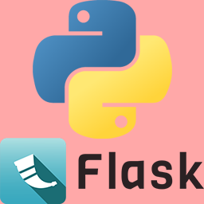

#  pyflask-file-server

## 这是什么?
* 这是一个仿照 `python -m http.server` 的文件下载服务器, 基于 [python flask](https://flask.palletsprojects.com/)

## 为什么要重写? `python -m http.server` 不好用吗?
* 并不是它不好用, 而是使用 `flask` 重写后可以使它支持 [断点续传](#什么是断点续传)

## 好的, 那么我该如何安装呢?
* 直接从 `Releases` 下载
  1. 打开 [Releases 页面](https://github.com/zhuhansan666/pyflask-file-server/releases)
  2. 找到您所需要的版本 (推荐最新版)
  3. 下载 `main.win64.zip`
  4. 解压 `main.win64.zip`
  5. 使用 `cmd` 或 `powershell` (以及其他命令行终端) 运行解压后释放的目录中的 `main.exe`

* ### 使用 python 运行
  1. 首先, 请确保您安装了 **`python 3.10`** 或更高版本, 您可以在这里下载我们推荐的版本: [python 3.10.9](https://www.python.org/downloads/release/python-3109/)
  2. 其次, 您应将源码从 `github` 拉取下来
    运行如下命令
    `git clone https://github.com/zhuhansan666/pyflask-file-server`
  1. 将命令行工作路径转到 `cd ./pyflask-file-server` (←是的, 运行这个)
  2. 然后使用 `python 3.10` (或更高版本) 创建虚拟环境 *(非必要但推荐)*
    运行如下命令
    如果您只安装了一个 `python`, 那么您可以直接运行 `python -m venv ./venv` (其中, `./venv` 代表了虚拟环境输出的文件夹)
    如果您安装了多个 `python`, 那么在 `Windows` 系统下您可以 `py -3.10 -m venv ./venv` (`./venv` 解释同上)
      > 您安装了 `linux` 或 `Mac OS` 我们假设您应当会基本的命令行操作, 可自行创建
  1. 切换到虚拟环境, 在 `Windows` 上, 应运行 `./venv/Scripts/activate`
    在 其他操作系统 上, 应运行 `./venv/bin/activate` (我觉得您应当会给文件添加可执行权限, 如 `chomd +x ./venv/bin/activate`)
  1. 安装依赖包
    运行如下命令
    `pip install -r ./requirements.txt`
  1. 待安装完成后, 您就可以愉快的运行我的代码啦~
    运行如下命令以运行代码
    `python ./src/main.py`

## 安装一切顺利! 那么我该如何使用呢?
* 您可以在运行 `main.py` 时附加参数
* 目前支持的参数有 (`<*>` 代表您需填入的参数)
    1. `--host=<host>` 启动时监听的主机地址, 默认为 `0.0.0.0` 
    2. `--port=<port>` 启动时的端口, 默认为 `flask` 默认值, 一般为 `5000`
    3. `--watch-dir=<dir>` / `--watchdir=<dir>` 启动时扫描的根文件夹, 将显示其内文件, ~~万物起源将从这里开始~~
    4. `--debug` (附加参数, 如果您携带此参数即视为启用, 下均同) 开启 `flask` 内置的 `DEBUG` 模式. 如果您不知道这是什么, 请勿附带.
    5. `--no-recursion` / `--norecursion` 是否不递归扫描(即扫描子文件夹), 默认值为 `True`, 携带本参数后禁用.

## wow~ 真不错...欸? 这是个 bug 吗?
* 如果您发现了 `bug`, 或者自行解决很久都没有办法解决的问题, 您可以在 `github` 的 `issues` 板块提出问题
  请尽量**描述详细**, 附带**命令行输出**或**运行日志**.

## ***, 你这写的什么代码? 跟 `shit` 有区别吗?
* 你说的对，但是《Python》是一种编程语言。它在一个被称作「解释器」的程序中，在这里，被用户输入的代码将被授予「执行」，导引计算机之力。你将学习一位名为「Guido van Rossum」的人, 在1989年创造的语言，和它的语法，特性，应用——同时，逐步掌握「编程」的技能。
* 有能力可以 `fork` 并 `pr`, 别在这里只知道说.

## 你这代码还行, 我白嫖了, 有什么需要注意的吗?
* 本代码遵循 `MIT` 开源协议, 在不违反协议的前提下您可随意分发或使用
* 关于协议的更多内容, 请参阅 [LICENSE](./LICENSE)

## 什么是断点续传
* 断点续传是在下载或上传时，将下载或上传任务（一个文件或一个压缩包）人为的划分为几个部分，每一个部分采用一个线程进行上传或下载，如果碰到网络故障，可以从已经上传或下载的部分开始继续上传或者下载未完成的部分，而没有必要从头开始上传或者下载。
  源: 与必应的对话， 2023/8/4
